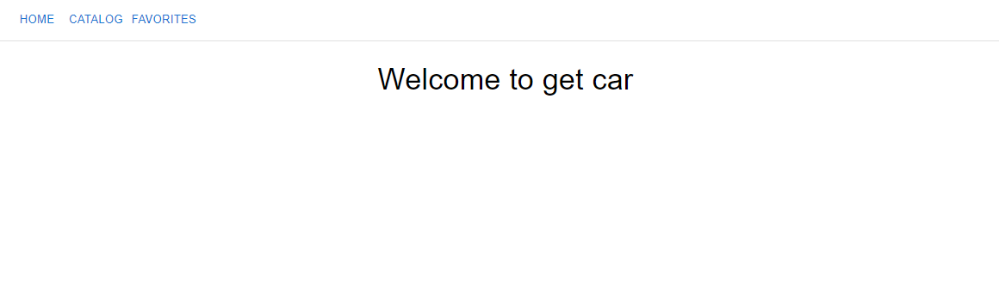
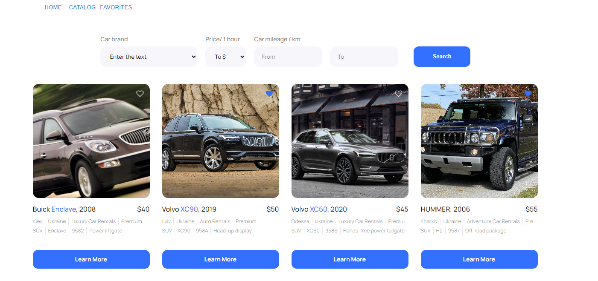
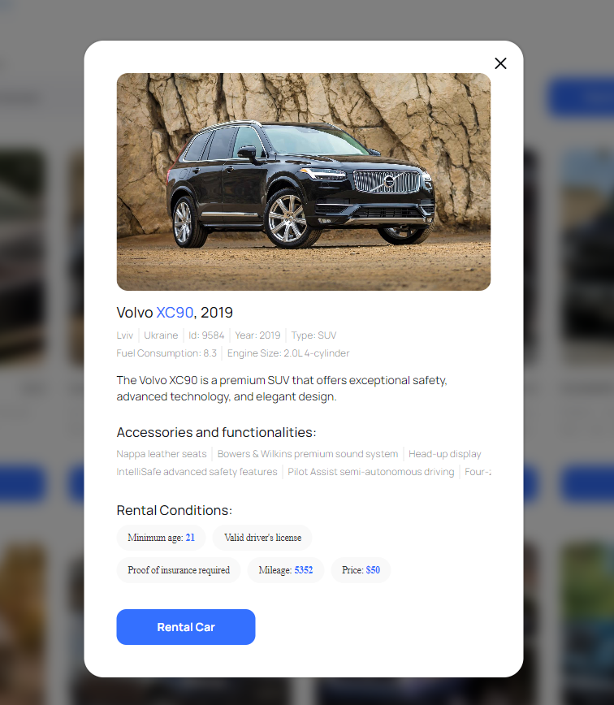

# Get car

This is React the single user get car web application

The first opening may be long, because free mockapi service is used for backend
deployment.

## Table of Contents

- [Features](#features)
- [Getting Started](#getting-started)
  - [Installation](#installation)

## <a id="features">Features</a>

The get car App provides a set of functions that allow single user to
interact with the system through web UI (see [Usage](#usage)):

- Get a catalogue of cars for rent
- View detail of a rental car
- Search cars by different filter options
- Mark or unmark car as favorite
- View favorite cars

## <a id="getting-started">Getting Started</a>

### <a id="installation">Installation</a>

1. Clone the repository to your local machine:
   ```
   git clone https://github.com/ectionboy/get-car.git
   ```
2. Change your current directory to the project folder:
   ```
   cd get-car
   ```
3. Install the project dependencies:
   ```
   npm install
   or
   yarn install
   ```
4. Start the app:
   ```
   npm start
   or
   yarn start
   ```

Your get car App should now be running and accessible at
`http://localhost:3000/get-car`







